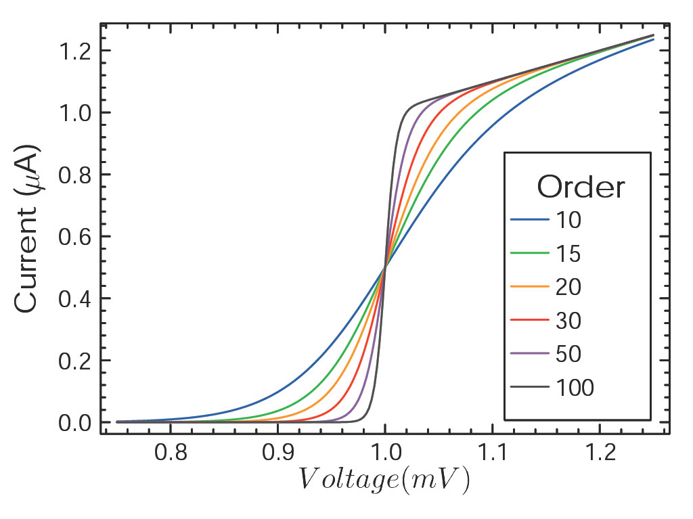

# SciencePlt.jl

A package to create nice looking plots

## Overview

Will provide a simple interface for creating professional scientific plots in Julia

## Features

- Clean, publication-ready theme optimized for scientific figures
- Proper font selection (Times New Roman) suitable for scientific publications
- Carefully selected color palette for good contrast and readability
- Sensible defaults for plot dimensions, tick marks, and grid lines


# How to use it?
- Install the package:
  ```julia
    using Pkg
    
    Pkg.add(url="https://github.com/maxreiss123/SciencePlt.jl.git")

    ```
- Employ the styles as given in examples:
  ```julia
      using SciencePlt
      using Plots
      using LaTeXStrings

      x = [i for i in 1:10]
      y = x .^ 2

      #short look what styles are available: 
      list_styles()
      use_style("science") 

      plot(x,y, title=L"Function: X^2")

    ```
 
  
 # Acknowledgement
 - The package was inspired by the great looking [SciencePlots](https://github.com/garrettj403/SciencePlots)

# Example Plot



## Work in progress
